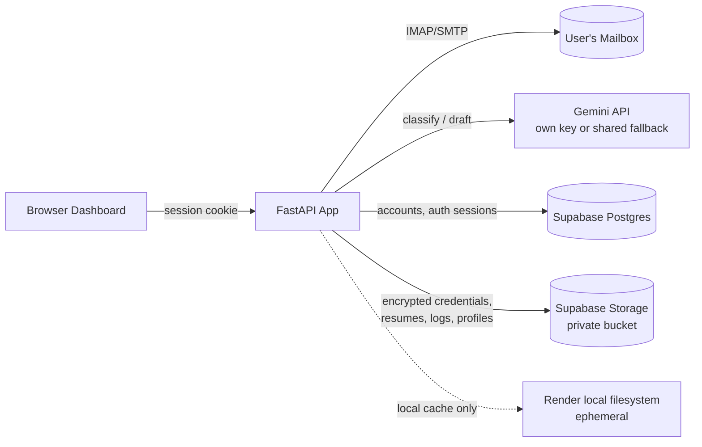

<div align="center">

# 📬 CareerPing

**Your inbox, triaged by AI.**
An open-source, self-hostable email agent that reads your career-related mail, decides what to do with it, and either replies for you, flags it for your attention, or leaves it alone — all from a clean browser dashboard.

[](#-deployment-render--supabase-free-tier)
[](#-deployment-render--supabase-free-tier)
[](#-tech-stack)
[](#-tech-stack)
[](#-license)

[Demo](#-video-demo) · [Features](#-features) · [Quick Start](#-quick-start-local) · [Deployment](#-deployment-render--supabase-free-tier) · [Architecture](#-architecture) · [FAQ](#-faq)

</div>

---

<a href="https://careerping.onrender.com/">
  
</a>

&nbsp;

<a href="https://github.com/NEC0S/CareerPing">
  
</a>

---

## 🎥 Video Demo


https://github.com/user-attachments/assets/6f8e69df-291a-4f7d-aad5-268e1beb50ba


---

## What is CareerPing?

CareerPing watches a job-search inbox and acts as a first pass over every incoming email: recruiter outreach, interview scheduling, rejections, offers, assessments. For each unread, career-related message it decides — using an LLM plus the context you give it — whether to **auto-reply**, **flag it for you** with a reason, or **skip** it, and logs every decision so nothing happens silently.

It's multi-tenant by design: anyone who opens the deployed site connects their **own** mailbox in the browser. Nothing about which inbox to watch is hard-coded on the server — your credentials, resume, and profile are scoped to your session and encrypted at rest.

## ✨ Features

- **Bring-your-own-inbox** — connect any IMAP/SMTP mailbox (Gmail app passwords work out of the box) directly from the browser; no server-side account provisioning.
- **LLM-driven triage** — every unread, career-related email is read and classified: reply automatically, flag for manual review (with a stated reason), or skip.
- **Per-email context** — upload a resume (PDF) and a short profile summary; this is the *only* context the agent is allowed to draw on when drafting replies, so responses stay grounded in your actual background.
- **Bring-your-own-Gemini-key, or use the shared fallback** — paste a personal Gemini API key, or rely on a server-configured shared key if you want a no-key-required experience for visitors.
- **Dry-run by default** — "Send replies for real" is an explicit opt-in toggle. Until you flip it, the agent still makes and logs every decision, but nothing is actually emailed or pushed.
- **Manual + scheduled polling** — **Check inbox now** for an on-demand pass, or **Start watching** for automatic polling every `POLL_INTERVAL_SECONDS`.
- **Full activity log** — every email the agent looked at, in order, with its decision and reasoning. Click into any auto-reply to see the exact text that was sent.
- **Optional Pushover notifications** for flagged items.
- **Durable on free hosting** — session credentials, resumes, summaries, handled-message IDs, and logs are mirrored to private Supabase Storage, so a Render Free redeploy or filesystem wipe doesn't lose your setup.
- **Safe re-polling** — handled-message IDs are persisted after *every* email (not once per batch), and emails missing a `Message-ID` header get a stable fallback key, so nothing gets silently replied-to twice.

## 🏗 Architecture



| Layer | Responsibility |
|---|---|
| **Render Free Web Service** | Runs the FastAPI/Docker app; serves the public `*.onrender.com` URL and the background polling thread while awake. |
| **Supabase Postgres** | Application accounts and authentication sessions. |
| **Supabase Storage** (private bucket) | Per-user mailbox credentials (encrypted with `ENCRYPTION_KEY`), resumes, summaries, supporting documents, handled-message IDs, logs, and saved per-inbox profiles. |
| **Render local filesystem** | Temporary working cache only — never relied on for durability. |

This split exists because **Render Free has an ephemeral filesystem**: anything written to disk is lost on sleep or redeploy. CareerPing mirrors each user's session workspace into private Supabase Storage instead, so free-tier hosting doesn't mean losing your setup.

## 🧰 Tech Stack

- **Backend:** FastAPI, SQLAlchemy, Uvicorn
- **Database:** PostgreSQL (Supabase-hosted), local dev falls back to SQLite
- **Storage:** Supabase Storage (private bucket)
- **LLM:** Google Gemini, per-user or shared fallback key
- **Auth/session:** Cookie-based, no username/password — "this browser = this inbox"
- **Secrets:** `cryptography` (Fernet) for at-rest encryption of mailbox credentials
- **Frontend:** Single-page HTML/JS (`app/static/index.html`), no build step
- **Packaging:** Docker

## 🚀 Quick Start (local)

```bash
cd app
pip install -r requirements.txt
uvicorn app:app --reload --port 8002
```

Open **http://localhost:8002** — you'll land on the setup screen.

For local development, omit `DATABASE_URL` (SQLite is used automatically) or set it explicitly:

```env
DATABASE_URL=sqlite:///./career_agent.db
COOKIE_SECURE=0
```

Generate an encryption key once (required — mailbox credentials are encrypted at rest):

```bash
python -c "from cryptography.fernet import Fernet; print(Fernet.generate_key().decode())"
```

Optional `.env` next to `app.py` (see `app/.env.example`):

```env
GOOGLE_API_KEY=fallback_gemini_key_for_visitors_without_their_own
DAYS_TO_SCAN=2
POLL_INTERVAL_SECONDS=120
```

### Run with Docker instead

```bash
docker build -t careerping .
docker run -p 8000:8000 --env-file app/.env careerping
```

## ☁️ Deployment: Render + Supabase (free tier)

CareerPing ships ready for a **$0/month** demo deployment on Render Free + Supabase Free.

### 1. Supabase setup

1. Create one Supabase project on the **Free** plan.
2. Open **Connect** and copy the **Session pooler** PostgreSQL connection string (port `5432`) — this is Supabase's IPv4-compatible option for persistent backends. Put it in Render as `DATABASE_URL`.
3. Open **Settings → API** and copy the server-side **`service_role`** key. Put it in Render as `SUPABASE_SERVICE_ROLE_KEY`. **Never expose this value to the browser.**
4. Leave `SUPABASE_STORAGE_BUCKET=career-files`. The app creates this bucket automatically on first startup if it doesn't already exist, and it's private by default.
5. Deploy. SQLAlchemy creates the application's tables automatically on startup — no manual migration step.

### 2. Render setup

Create **New → Web Service** and connect the GitHub repository, then configure:

| Setting | Value |
|---|---|
| Environment | `Docker` |
| Root Directory | *(blank)* |
| Dockerfile Path | `Dockerfile` |
| Plan | `Free` |
| Health Check Path | `/health` |

Add the environment variables below, then deploy. The public URL is the Web Service's `https://<service-name>.onrender.com` address — the Supabase database URL is never exposed to the browser.

### 3. Production environment variables

Set these in **Render → Environment**. Do not commit them to GitHub.

| Variable | Description |
|---|---|
| `DATABASE_URL` | `postgresql://postgres.<PROJECT_REF>:<PASSWORD>@aws-<REGION>.pooler.supabase.com:5432/postgres` — Supabase Session pooler string |
| `ENCRYPTION_KEY` | Fernet key generated locally (see above) — encrypts mailbox credentials at rest |
| `COOKIE_SECURE` | `1` in production |
| `GOOGLE_API_KEY` | Shared Gemini fallback key, used when a visitor doesn't supply their own |
| `DAYS_TO_SCAN` | How many days back to scan on each pass (default `2`) |
| `POLL_INTERVAL_SECONDS` | Background polling interval while the service is awake (default `120`) |
| `SUPABASE_URL` | `https://<PROJECT_REF>.supabase.co` |
| `SUPABASE_SERVICE_ROLE_KEY` | Server-side only — never expose to the browser |
| `SUPABASE_STORAGE_BUCKET` | `career-files` |

### What's stored where

| Store | Contents |
|---|---|
| **Supabase Postgres** | Application accounts and authentication sessions |
| **Supabase Storage** | Encrypted mailbox credentials, resumes, summaries, supporting documents, handled-message IDs, logs, saved per-inbox profiles |
| **Render local filesystem** | Temporary working cache only |

### ⚠️ Free-tier behavior to know before you rely on this

- **Render Free sleeps** after 15 minutes without inbound traffic, and **loses its local filesystem** on sleep/redeploy — this is why Supabase Storage carries all durable state.
- **Background polling only runs while the service is awake.** The email watcher is a thread inside the FastAPI process, so a sleeping service isn't polling. Use **Check inbox now** after the service wakes to catch up, or move to a paid always-on plan for continuous background polling.
- **Supabase Free** currently includes 500 MB database size and 1 GB file storage, and free projects may pause after a period of inactivity.

This setup is well suited to a **demo or personal hobby deployment**. For continuous unattended polling, upgrade Render off the Free plan.

## 🖥 How the dashboard works

- **Check inbox now** — runs one pass over your inbox immediately.
- **Start / Stop watching** — starts or stops the background loop that polls automatically every `POLL_INTERVAL_SECONDS`.
- **Send replies for real** — off = dry-run (the agent still decides what it would do, but nothing is emailed or pushed); on = live behavior.
- **Activity list** — every email looked at, in order, with what it decided: replied automatically, flagged for you (with why), or skipped. Click "Show reply" on a replied item to see the exact text sent.
- The left panel shows whether your resume/summary were found, whether you're on your own Gemini key or the shared fallback, and when the inbox was last checked.

## 🔁 Behavior details

- Scans the last **2 days** by default (`DAYS_TO_SCAN`, configurable).
- Only auto-replies to emails that are still **unread** — if you've already opened a career-related email yourself, the agent leaves it alone and logs "already read - leaving it for you to handle personally."
- Handled-message IDs are saved after **every single email**, not once per batch, so one bad email mid-batch can't cause everything before it to be silently re-sent on the next poll.
- Emails with no `Message-ID` header get a stable fallback key derived from From/Subject/Date, so they aren't rediscovered and re-replied-to forever.
- "Check inbox now" and the background poller share a lock per session, so they can never race and overwrite each other's saved progress.

## 🔐 Security notes

- Mailbox app passwords, and optionally a personal Gemini key and Pushover credentials, are **encrypted at rest** with `ENCRYPTION_KEY` before being written to Supabase Storage.
- The Supabase `service_role` key is server-side only and must never be exposed to the browser or committed to source control.
- There is no username/password login — access is tied to the browser cookie. If you lose the cookie, reconnect via setup again with the same email; nothing is deleted except by an explicit **Change account**, which wipes that session's data from the server.
- For a public multi-tenant deployment, put the app behind HTTPS (Render provides this automatically) and treat `ENCRYPTION_KEY` as a production secret with the same care as a database password.

## 📁 Project structure

```
career-email-agent-fixed/
├── Dockerfile                # Production image (Render-ready)
├── docker-compose.yml        # Local multi-container option
└── app/
    ├── app.py                # FastAPI application, IMAP/SMTP, LLM triage logic
    ├── requirements.txt
    ├── .env.example
    └── static/
        └── index.html        # Single-page dashboard frontend (no build step)
```

## ❓ FAQ

**Can I deploy this to Vercel, Netlify Functions, or AWS Lambda?**
No — CareerPing runs a background polling thread that needs to keep running between requests. Serverless hosts spin the process down between invocations and kill background loops. Use a host that keeps one process alive: Render, Railway, Fly.io, or a plain VPS.

**Do I need my own Gemini API key?**
No, if the deployment operator has set a shared `GOOGLE_API_KEY` fallback. Otherwise each visitor supplies their own key during setup.

**What happens if I close the tab or lose my cookie?**
Nothing is deleted. Reconnect via the setup screen with the same email address to pick back up — your session workspace is durable in Supabase Storage.

## 🗺 Roadmap ideas

- Always-on polling via a paid Render tier or a separate worker process
- Multi-account support per browser session
- Configurable auto-reply approval workflow (review before send)
- Export activity log as CSV/PDF

## 🤝 Contributing

Issues and pull requests are welcome. If you're proposing a change to the triage logic, please include a couple of example emails and the decision you'd expect.

## 📄 License

MIT — see `LICENSE` for details.

---

<div align="center">
<sub>Built with FastAPI, Supabase, and Gemini. Free to deploy, free to self-host.</sub>
</div>
